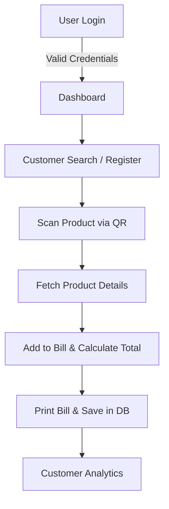

#  Smart Retail QR Billing & Customer Analytics System

A **Python-based desktop billing application** built using **Tkinter** and **MySQL** for supermarkets and retail stores. 
This system automates **QR code-based billing**, manages **customers and products**, and provides **customer analytics** to identify **Most Valued** and **Least Valued** customers.

---

## ** Features**

### **1. User Authentication** 
- Secure login system for staff members.
- Validates credentials from the **MySQL database**.
- Displays the logged-in cashier's name on the dashboard.

### **2. Customer Management** 
- **Search Existing Customers** using their phone number.
- **Register New Customers** and store their details.
- Track **customer history** and linked billing data.

### **3. QR Code-Based Product Billing** 
- **QR scanning** for faster product identification.
- Automatically fetches **product name, price, and stock** from inventory.
- Real-time **total calculation** based on quantity and price.

### **4. Smart Billing & Printing** 
- Generates a **detailed bill** showing purchased items and total cost.
- Supports **direct bill printing**.
- Stores billing data in an **analytics table** for reporting.

### **5. Customer Analytics Dashboard** 
- **Most Valued Customer (MVC)** → Customer with **highest spending**.
- **Least Valued Customer (LVC)** → Customer with **lowest spending**.
- Helps owners track **customer behavior** and plan offers.

### **6. Database Management** 
- MySQL database handles:
    - Customer details
    - Inventory data
    - Billing transactions
    - Analytics reports

---

## ** Technologies Used**

| **Component**        | **Technology**          |
|----------------------|--------------------------|
| Language            | Python                   |
| GUI Framework      | Tkinter                 |
| Database          | MySQL                   |
| QR Code Integration | Custom `QR_Scanner` Module |
| File Handling      | Bill printing            |
| Subprocess        | Launch billing module from login |

---

## ** Project Workflow**



---

## ** Customer Analytics Example**

| **Customer Name** | **Total Purchases (₹)** | **Category**    |
|--------------------|-------------------------|------------------|
| Rahul Sharma      | ₹12,500                 | Most Valued     |
| Priya Verma       | ₹8,200                  | Medium         |
| Kunal Das         | ₹1,500                  | Least Valued   |

---

## ** How to Run**

```bash
# 1. Clone the repository
git clone https://github.com/your-username/Smart-Retail-QR-Billing.git

# 2. Navigate to project folder
cd Smart-Retail-QR-Billing

# 3. Install dependencies
pip install pymysql

# 4. Run the login script
python login_window.py
```


[GUI.pdf](https://github.com/user-attachments/files/22072421/Screenshot.2025-09-01.111639.pdf)
